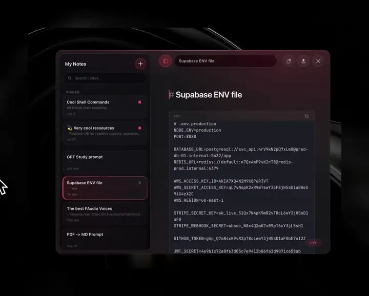

<p align="center">
  
</p>

<h1 align="center">Raynote</h1>

<p align="center">
  Just notes. A little bit of Markdown, local files, and some keyboard.
</p>

<p align="center">
  <a href="https://github.com/Lxvi101/LeviNote/releases/latest">Download</a>
  &nbsp;&middot;&nbsp;
  <a href="#run-it">Run it</a>
  &nbsp;&middot;&nbsp;
  <a href="#how-it-works">How it works</a>
</p>

<p align="center">
  
</p>

I wanted a small notes app, so I made one. Raynote keeps notes as Markdown in iCloud and has reading, live-preview, and raw-source modes.

It is very early. Things will not work as expected. Some key bindings are probably weird because I basically have no clue how to use a keyboard. I ain't one of those Vim users. Yet.

Start with `Cmd+Shift+P` for the command palette. Shortcuts can be rebound in Settings (`Cmd+,`).

## Run it

You need macOS, [Node.js](https://nodejs.org/), and [Rust](https://rustup.rs/).

```sh
npm install
npm run tauri -- dev
```

For a production build:

```sh
npm run tauri:build
```

## How it works

```text
Vite + browser UI + CodeMirror
              ↕ Tauri IPC
Rust: files, cache, shortcuts, windows
              ↕
       iCloud folder of .md files
```

- `src/` owns the interface, editor, and Markdown rendering.
- `src-tauri/` owns file access, metadata caching, and macOS behavior.
- Notes live in `~/Library/Mobile Documents/com~apple~CloudDocs/Raynote`.

That is most of it.

## Contributing

Contributions that fix the mess I have started are very welcome. Open an issue or send a pull request. Before sending code, run:

```sh
npm test
npm run build
```

MIT licensed.
